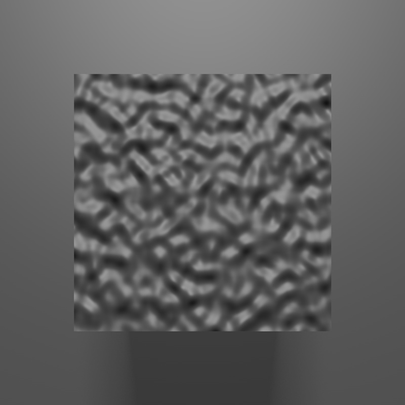
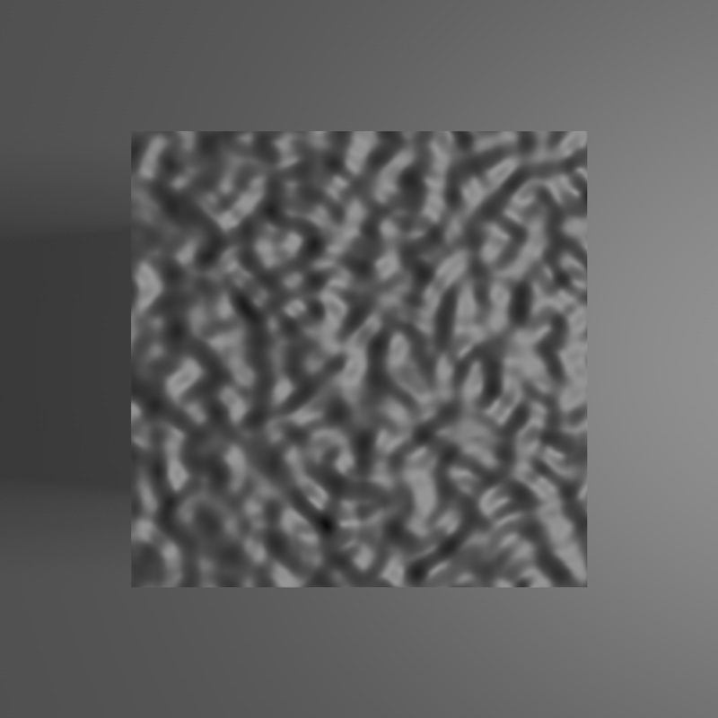
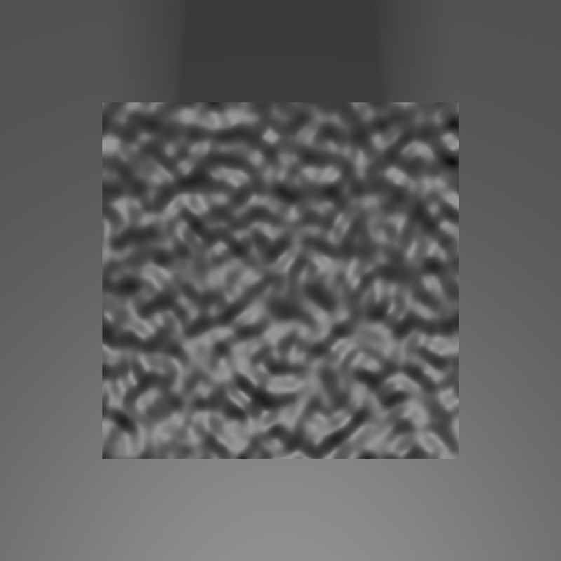
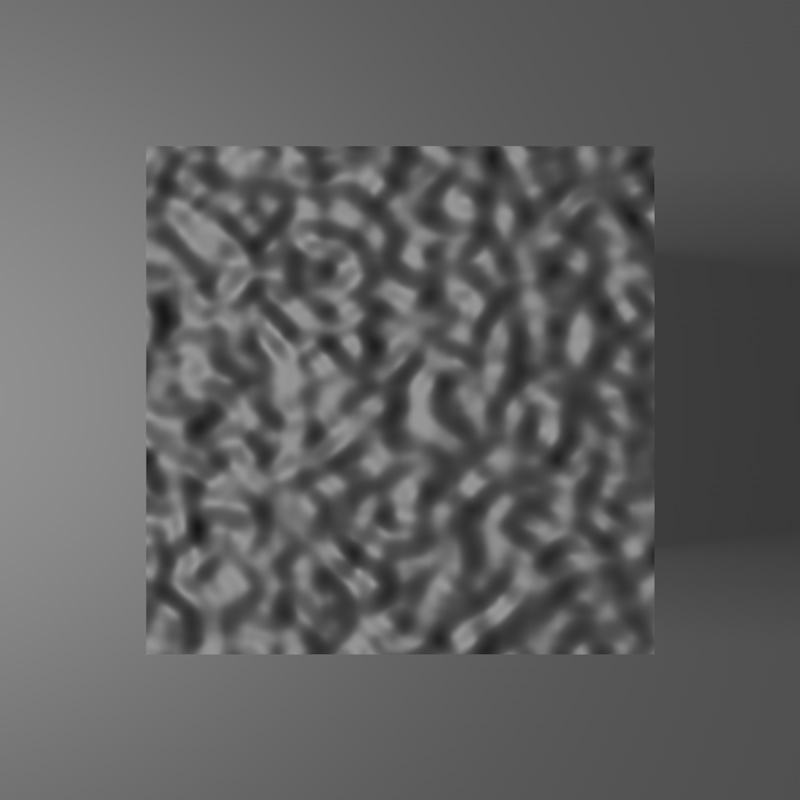
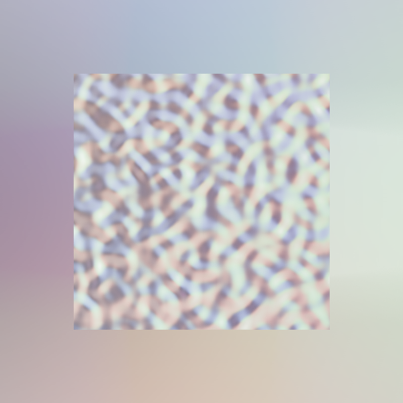
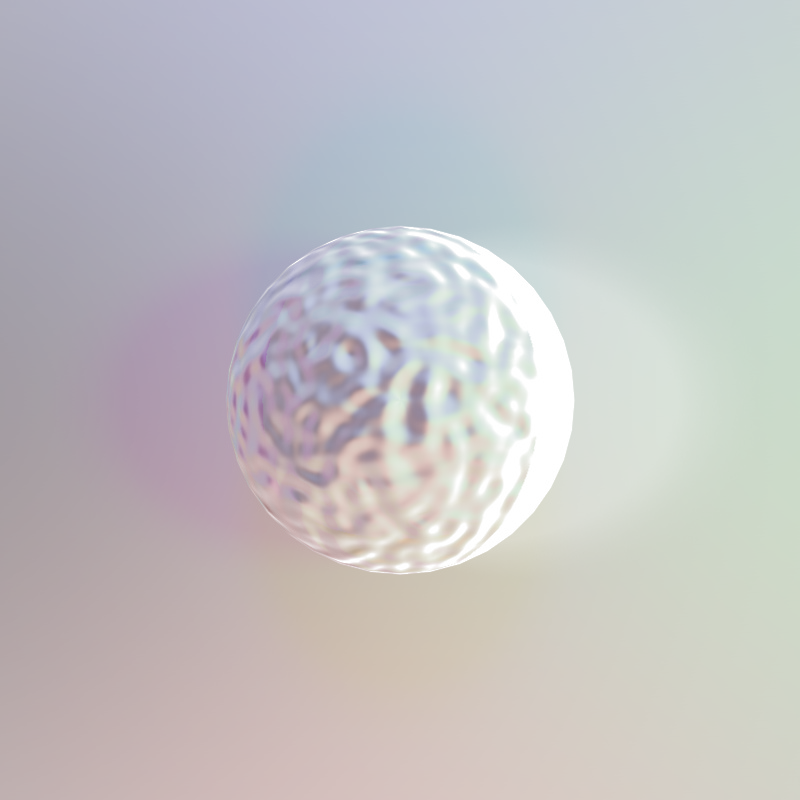
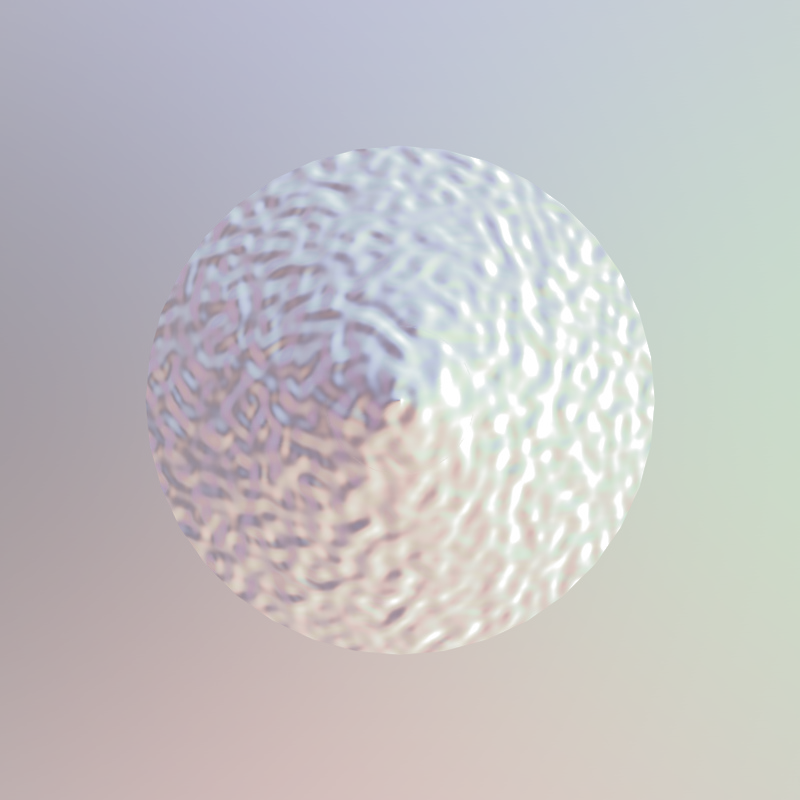
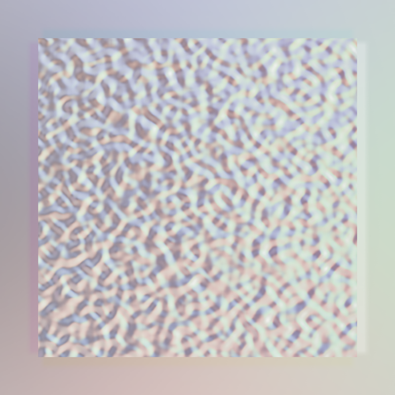
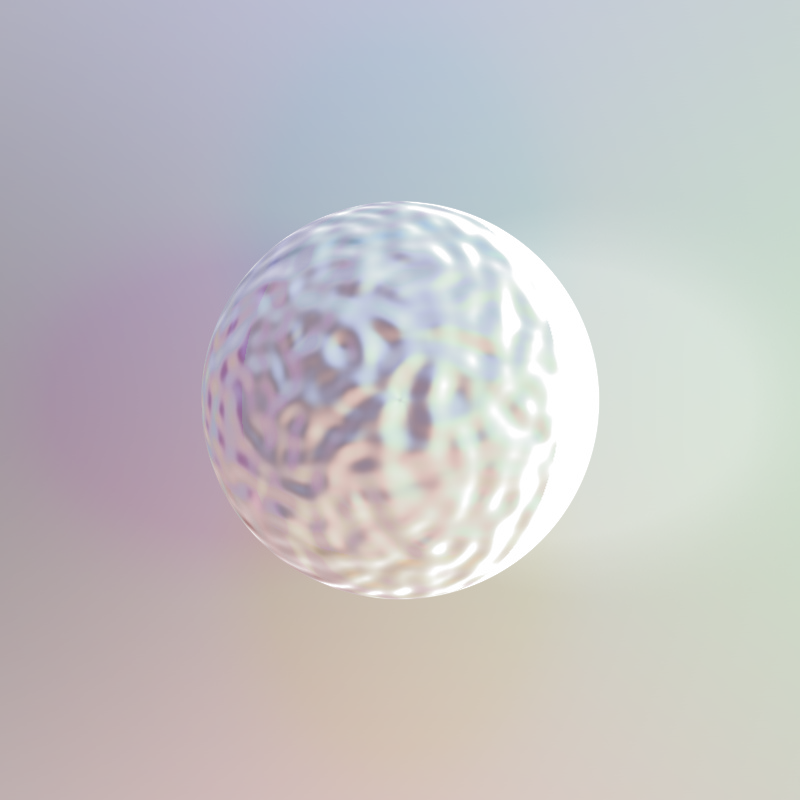

# Channel Image Composition using Python-OpenCV
This is an Pyton-OpenCV example that composes 4 channels(R, G, B, A) of an image(.png) from 4 grayscale images.

## Development Environment
* Python Version: +3.x

## Prerequisites
* Python OpenCV module
* Numpy module

## Example
* 1st Channel

* 2nd Channel

* 3rd Channel

* 4th Channel

* Result Channel Composition Image

Also, another examples

